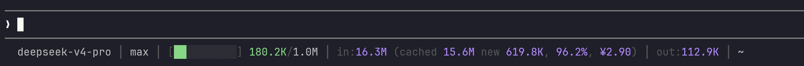

# claude-code-statusline

这是一个给 Claude Code 使用的自定义 statusline。

它会读取 Claude Code 传入的状态信息和 transcript，统计并显示当前会话的模型、effort、上下文窗口、输入 token、缓存命中、新输入、输出 token、费用和当前目录。主会话和 subagent transcript 的用量会汇总到同一个价格里，所以状态栏里看到的是当前会话相关用量的总费用。



## 安装

把这个仓库放到 `~/.claude` 下面：

```bash
git clone git@github.com:top-tree/claude-code-statusline.git ~/.claude/claude-code-statusline
```

然后编辑 `~/.claude/settings.json`，加入或替换 `statusLine` 配置：

```json
{
  "statusLine": {
    "type": "command",
    "command": "python3 /home/你的用户名/.claude/claude-code-statusline/statusline.py"
  }
}
```

不要覆盖 `settings.json` 里的其他字段；如果文件里已经有别的配置，只把 `statusLine` 这一段合并进去。

如果你的系统里 Python 命令不是 `python3`，就把前面的 `python3` 换成实际可用的 Python 命令，例如 `python`、虚拟环境里的 Python，或 Python 的绝对路径。

如果你没有把仓库放在 `~/.claude/claude-code-statusline`，就把后面的 `statusline.py` 路径改成实际路径。

这个项目只依赖 Python 标准库。`config.json` 用来配置货币符号和模型价格。`sessions/` 是运行时缓存目录，不需要手动维护。
